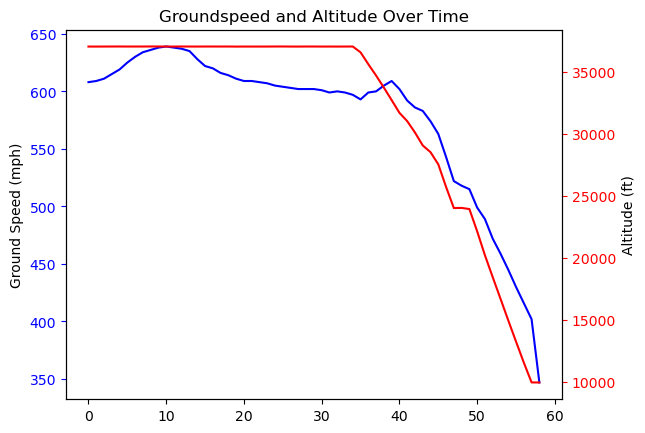

+++
title = 'More WiFi without internet on a Southwest flight'
date = 2023-10-04T11:24:00-06:00
+++

After reading James Vaughan's
[write-up](https://jamesbvaughan.com/southwest-wifi/) about what he could do
with a connection to the flight’s WiFi without access to the internet, and an
upcoming Southwest flight of my own, I'd thought I'd replicate his findings and
see what else was lurking around the airlines' network.

First, the data collection:

```bash
while true; do 
    http getconnected.southwestwifi.com/current.json | jq > current_$(date +%Y%m%d%H%M).json; 
    sleep 60; 
done
```

I started this maybe 30 minutes into my flight so wasn't able to get the full
duration, but at the end the data checks out!



But what else is lurking around?

My initial attempt to collect data actually didn't end up as expected. The pilot
rebooted the wifi right at the start of our flight and so to debug when it would
be working again, I kept trying to curl the IP address of the initial connection
point: initial.southwestwifi.com. Curl kept returning an SSL error, so without
reading further I figured I'd give [httpie](https://github.com/httpie/cli) a
try. This gave me a much more useful response message! Specifically, the server
couldn't validate the known hostnames tied to the SSL cert with my request. It
was expecting one of the following:

```bash
southwestwifi.com
pa.southwestwifi.com
crm.southwestwifi.com
www.southwestwifi.com
media.southwestwifi.com
stream.southwestwifi.com
initial.southwestwifi.com
opsdata.southwestwifi.com
test-crm.southwestwifi.com
connected.southwestwifi.com
flightdata.southwestwifi.com
getconnected.southwestwifi.com
```

After a quick nslookup on each of these, we had the following table:

```bash
southwestwifi.com                192.168.35.1
pa.southwestwifi.com
crm.southwestwifi.com            208.81.181.206
www.southwestwifi.com            192.168.35.1
media.southwestwifi.com          192.168.35.131
stream.southwestwifi.com         192.168.35.130
initial.southwestwifi.com        192.168.36.1
opsdata.southwestwifi.com
test-crm.southwestwifi.com       208.81.181.205
connected.southwestwifi.com      192.168.34.1
flightdata.southwestwifi.com
getconnected.southwestwifi.com   192.168.35.1
```

Most of these look to be local to the aircraft itself. But what are those 208
addresses?

```bash
nslookup 208.81.181.206\
206.181.81.208.in-addr.arpa     name = troy1.dc.nubill.net.
...
```

Curling that endpoint got me a 403, so I didn't investigate any further, but it
appears to be some proxy given the squid header I received in the response.

At this point I looked back in my browser where I was still logging network
traffic to confirm the repeated requests for `current.json` when I noticed
another file: `log_heartbeat_connectivityalerts.json`. 

I immediately saved the HAR dump from my browser session and began exploring.
Looks like Southwest also POSTS the following data periodically while you're
connected to WiFi during your flight:

```json
{
  "params": [
  {
    "name": "mac_address",
    "value": "..."
  },
  {
    "name": "url",
    "value": "/"
  },
  {
    "name": "tab",
    "value": "540"
  },
  {
    "name": "satcomm_status",
    "value": "active"
  },
  {
    "name": "connection_active",
    "value": "true"
  },
  {
    "name": "livetv_error",
    "value": "na"
  },
  {
    "name": "livetv_coverage",
    "value": "yes"
  },
  {
    "name": "show_popup",
    "value": "false"
  },
  {
    "name": "show_notification",
    "value": "false"
  },
  {
    "name": "html_show_alerts",
    "value": "false"
  },
  {
    "name": "html_show_no_coverage",
    "value": "na"
  }
  ]
}
```

This got me wondering what other data could be or was being POSTed back to
Southwest. A quick grep for other endpoints with `log_` in them from the HAR
dump:

```bash
log_ad_data.json
log_games_event.json
log_heartbeat_connectivityalerts.json
log_javascript_message.json
log_jwplayer_error.json
log_portal_alerts.json
```

The `log_ad_data` endpoint was interesting. Specific adId and campaignId values
were in the post requests for this data, so I assume Southwest is doing some
targeted advertising even without purchasing WiFi or signing in given my MAC
address was sent.

I didn't play any games or open any video players included with the free WiFi,
so I'm not surprised by the lack of data for those endpoints. Finally, the
remainder of the JSON endpoints:

```bash
current.json
dcc_log.json
episode_info.json
episode_meta.json
episodes_for_season.json
series_playlist.json
set_has_player.json
set_media_notification_dismiss.json
sponsored_auth.json
```

Not the worst way I've spent a 4 hour layover. Wonder what else is out there,
Southwest!
